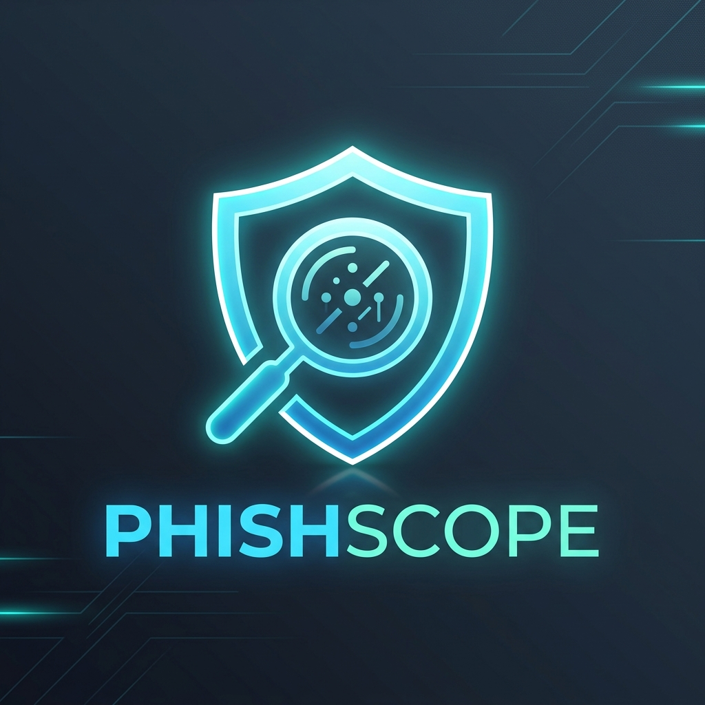
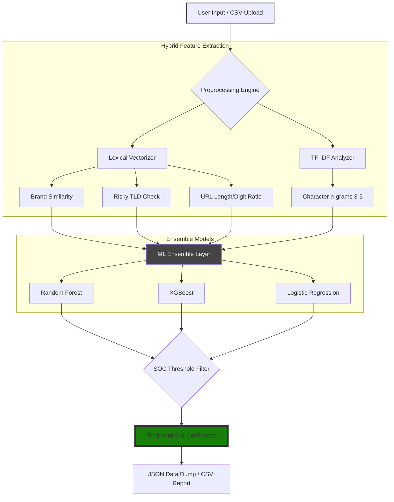

<div align="center">



# 🛡️ PhishScope
### The Machine Learning Watchtower for Phishing Intelligence

[](https://github.com/DarshakPatel2004/PhishScope/stargazers)
[](https://www.python.org/)
[](https://opensource.org/licenses/MIT)


---

**PhishScope** is a high-performance URL classification engine designed to dismantle phishing campaigns before they reach the user. By combining **Character n-gram TF-IDF vectorization** with **Custom Lexical Feature Engineering**, PhishScope provides 180k+ data-point validated intelligence to your security stack.

[Quick Start](#-quick-start) • [Scientific Performance](#-scientific-performance) • [Architecture](#-architecture) • [Features](#-key-capabilities)

</div>

---

## ⚡ Quick Start

> [!TIP]
> Use the **XGBoost** model for the highest precision in high-stakes environments.

```powershell
# 1. Prepare Environment
python -m venv venv; .\venv\Scripts\activate

# 2. Install Engine
pip install -r requirements.txt

# 3. Launch Watchtower
streamlit run app.py
```

---

## 🔍 Key Capabilities

<div align="center">

| Feature | Description | Icon |
| :--- | :--- | :---: |
| **Deep URL Inspection** | Decodes obfuscated patterns and character-level tricks. | 🧪 |
| **Ensemble Inference** | Cross-verify results between **Logistic**, **RF**, and **XGBoost**. | 🧠 |
| **SOC Dynamic Logic** | Real-time threshold adjustment via the **SOC Control Sidebar**. | ⚙️ |
| **Scalable Batching** | Scan thousands of IOCs using the **CSV Upload Pipeline**. | 📂 |
| **Evidence JSON** | Export structured technical evidence for incident response. | 📜 |

</div>

---

## 📊 Scientific Performance

PhishScope models are trained on a massive dataset of **186,230 URLs**, ensuring extremely low false-positive rates.

<div align="center">

| Model | Accuracy | F1-Score | Usage |
| :--- | :---: | :---: | :--- |
| **XGBoost** | `98.2%` | `0.98` | Most balance, high performance |
| **Random Forest** | `97.8%` | `0.97` | Robust to noise |
| **Logistic Reg.** | `96.5%` | `0.96` | Extremely fast inference |

</div>

> [!NOTE]
> *Accuracy stats based on character n-gram (3-5) TF-IDF vectorization on the PhishScope validation split.*

---

## 🏗️ Architecture



---

## 🧰 Tech Stack & Tools

- **Core Engine:** Python 3.11
- **Inference Layers:** `XGBoost`, `Scikit-Learn`
- **Frontend Dashboard:** `Streamlit`
- **Data Wrangling:** `Pandas`, `NumPy`, `TLDExtract`
- **Security Logic:** Custom heuristic matching via `difflib` and `re`

---

## 📁 Repository Overview

```ascii
PhishScope
├── app.py                      # Main App Logic
├── dataset.csv                 # 186k Sample Dataset
├── models_new/                 # Serialized Brain Components
│   ├── tfidf.pkl               # Feature Vectoriser
│   ├── xgb.pkl                 # Gradient Boosting Model
│   └── thresholds.pkl          # Optimal SOC Defaults
└── notebooks/                  # Experimental Research
    ├── Dataset_Builder.ipynb   # ETL Pipeline
    └── Detection_Logic.ipynb   # Training Labs
```

---

<div align="center">

**Built for the blue team. Zero cloud reliance. Pure ML.**

*Designed with 💙 by Darshak Patel*

[](https://fastapi.tiangolo.com)
[](https://react.dev)

</div>
